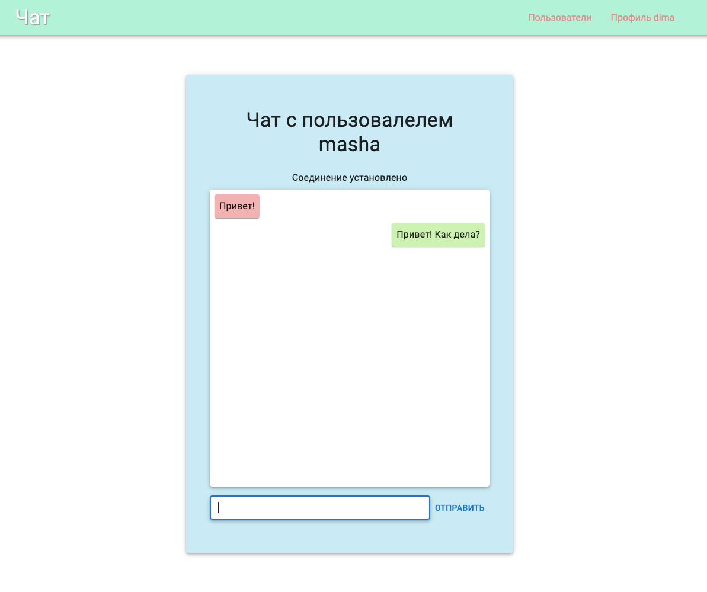
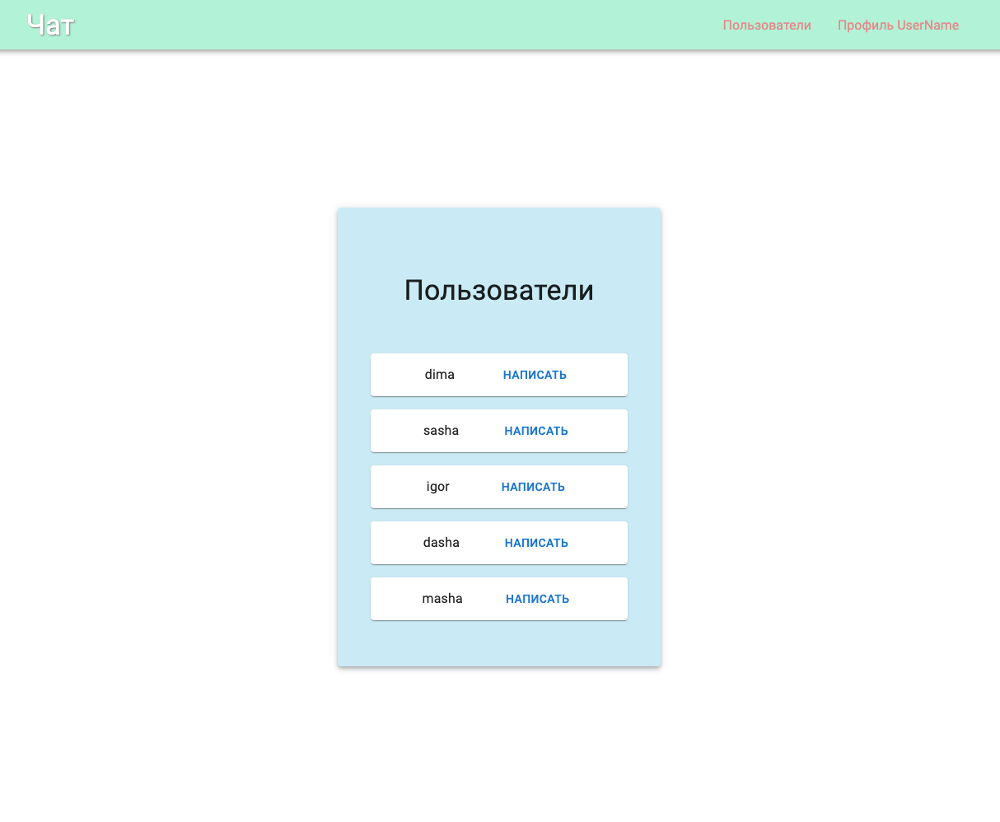

# Chat Front

Для запуска данного приложения нужно запусть его серверную часть (backend).

> ссылка на backend
> https://github.com/shellipov/chat_back

Приложени не поддерживает регистрацию.
Есть список пользователей для входа:

> username: "UserName", password: "Password"

> username: "dima", password: "dima"

> username: "sasha", password: "sasha"

> username: "igor", password: "igor"

> username: "dasha", password: "dasha"

> username: "masha", password: "masha"

Для запуска данной части программы:

> Скачать репозиторий.

> Перейти в папку с репозиторием

> В консоли ввести npm i или yarn для установки всех необходимых пакетов

> В консоли ввести npm start или yarn start для запуска приложения
